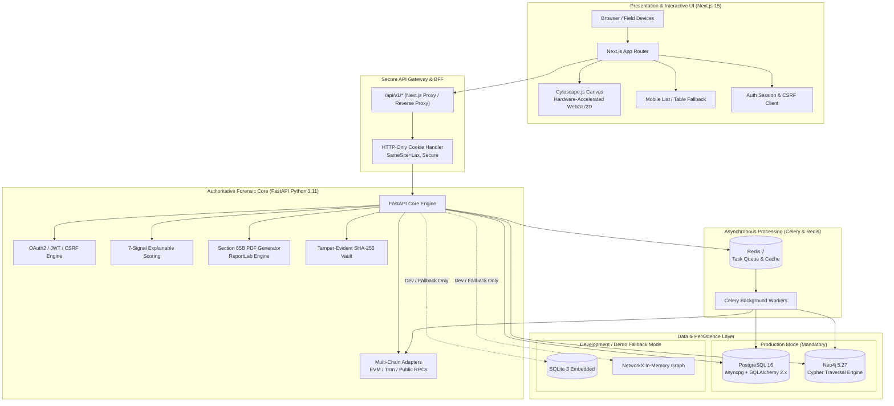
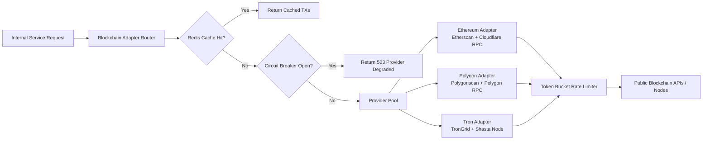

# CHAINTRACE — SYSTEM ARCHITECTURE SPECIFICATION

**Document ID**: CT-ARCH-2026-01  
**Version**: 1.0.0  
**Date**: September 14, 2026  
**Status**: Phase 4 Deliverable — Approved for Implementation Review  

---

## 1. Target Architecture Overview

CHAINTRACE is architected as a high-performance, decoupled forensic intelligence platform. The system separates user presentation and client-side graph interaction (Next.js 15 App Router + Cytoscape.js) from core forensic processing, cryptographic validation, Neo4j graph traversal, 7-signal scoring, and statutory reporting (Python FastAPI + Celery + PostgreSQL + Neo4j).



---

## 2. Frontend / Backend Responsibility Matrix

| Capability / Concern | Frontend Responsibility (Next.js + Cytoscape.js) | Backend Responsibility (FastAPI + Workers) |
|---|---|---|
| **Authentication** | Renders login UI, stores CSRF token in memory, redirects on 401/403. | Issues HTTP-only JWT cookies, rotates refresh tokens, validates passwords (bcrypt), enforces RBAC. |
| **Route Protection** | Middleware checks presence of non-sensitive session cookie for client navigation. | Server-side dependency checks cryptographically signed JWT and user clearance role on every single request. |
| **Address Validation** | Client-side immediate syntax validation (regex, length, basic checksum). | Authoritative EIP-55 keccak256 checksum and Tron Base58Check cryptographic validation. |
| **Blockchain Retrieval** | **Zero direct external API calls**. Never contacts Etherscan, TronGrid, or RPCs directly. | Centralized rate-limited adapters with circuit breakers, caching, and fallback endpoints. |
| **Graph Traversal** | Never performs graph BFS in client JavaScript; receives computed nodes and edges. | Executes Cypher queries in Neo4j (or bounded BFS in worker) and computes topological shortest paths. |
| **Graph Visualization** | Cytoscape.js canvas with drag/pan/zoom, bounding box controls, and mobile table fallback. | Returns normalized node and edge schemas with hop distances, weights, and entity classifications. |
| **Attribution Scoring** | Renders explainable score breakdown cards, radar charts, and statutory disclaimers. | Executes 7-signal mathematical formula, confidence bands, anti-overclaiming checks, and zero-guessing rules. |
| **Case Management** | Renders case dockets, timeline notes, evidence attachments, and creation modals. | Full ACID CRUD operations in PostgreSQL, transaction logging, and association joins. |
| **Report Generation** | Previews report metadata; triggers binary stream download. | Server-side PDF compilation (ReportLab), SHA-256 seal generation, and legal notice population. |
| **Audit Logging** | Passes client IP and officer session metadata. | Computes SHA-256 hash chaining, stores immutable records, and enforces non-repudiation. |

---

## 3. Production vs. Fallback Operational Modes

To ensure forensic validity while preserving rapid local developer onboarding:

```
+---------------------------------------------------------------------------------------------+
|                                    PLATFORM RUNTIME MODES                                   |
+---------------------------------------------------------------------------------------------+
| 1. PRODUCTION MODE (MANDATORY FOR PRODUCTION DEPLOYMENTS)                                  |
|    - Database: PostgreSQL 16 (via asyncpg and SQLAlchemy 2.x)                               |
|    - Graph DB: Neo4j 5.27 Enterprise / Community (via Cypher driver)                        |
|    - Queue/Cache: Redis 7 + Celery Workers                                                  |
|    - Evidentiary Status: PRODUCTION GRADE // COURT ADMISSIBLE                               |
|    - Fallback Behavior: Fail-closed; errors out if production services are unreachable.     |
+---------------------------------------------------------------------------------------------+
| 2. CONTROLLED DEVELOPMENT / DEMO FALLBACK MODE (LOCAL DEV ONLY)                             |
|    - Database: SQLite 3 (via aiosqlite + SQLAlchemy 2.x)                                     |
|    - Graph Engine: NetworkX In-Memory Traversal                                              |
|    - Evidentiary Status: EXPLICIT DEMO / NON-EVIDENTIARY (PROMINENT WARNING BANNER)         |
|    - Production Prohibition: NEVER silently active in production; checks ENVIRONMENT!=prod. |
+---------------------------------------------------------------------------------------------+
```

### Telemetry Header & Indicator Contract
Whenever fallback mode is active, the FastAPI backend returns:
- Header: `X-ChainTrace-Engine: FALLBACK-DEMO-SQLITE-NETWORKX`
- Header: `X-ChainTrace-Evidentiary-Status: NON_EVIDENTIARY_SIMULATION`
- Response Payload: `engine_mode: "fallback_simulation"`, `is_production_grade: false`.

The frontend renders a prominent amber alert:
> ⚠️ **DEMO / FALLBACK ENGINE ACTIVE**: Platform running on local in-memory storage (SQLite + NetworkX). Results are simulated demonstrations and must not be used as court-admissible forensic evidence.

---

## 4. External Blockchain API Adapter Design

All external blockchain data is accessed strictly through the backend adapter layer (`backend/app/services/blockchain/`):



### Adapter Specifications:
1. **Resilience & Timeouts**: Strict 8.0s timeout per external RPC request with 2 retries and exponential backoff.
2. **Circuit Breaking**: If an external explorer fails 5 consecutive times, the adapter enters `OPEN` state for 60s, returning cached data or graceful degradation notices.
3. **Data Normalization**: Raw transactions from EVM JSON-RPC and TronGrid REST APIs are normalized into a unified `NormalizedTransaction` schema before graph insertion.

---

## 5. Migration Plan from Existing Implementation

```
+---------------------------------------------------------------------------------------+
|                                    MIGRATION STAGES                                   |
+---------------------------------------------------------------------------------------+
| STAGE 1: Dependency Modernization & Clean Dual Backend                                |
|   - Add SQLAlchemy 2.x, asyncpg, reportlab, python-jose to backend.                   |
|   - Add cytoscape, cytoscape-dagre, @types/cytoscape to frontend.                     |
+---------------------------------------------------------------------------------------+
| STAGE 2: Database Migration & Persistence Implementation                              |
|   - Execute Alembic migration creating PostgreSQL tables (users, cases, vasps, logs).|
|   - Ingest data/vasp_database.json into PostgreSQL vasps and addresses tables.        |
|   - Deprecate synchronous fs.writeFileSync in Next.js vasp repository.                |
+---------------------------------------------------------------------------------------+
| STAGE 3: Neo4j Graph Initialization & Cypher Implementation                           |
|   - Run Cypher constraint migration (indexes on Wallet.address, VASP.id).             |
|   - Connect graph_service.py to real Neo4j driver.                                    |
+---------------------------------------------------------------------------------------+
| STAGE 4: Frontend Cytoscape.js Integration                                            |
|   - Replace raw SVG canvas in fund-flow-graph with <CytoscapeGraph /> component.     |
|   - Wire Next.js API client to FastAPI /api/v1 endpoints.                             |
|   - Remove false default attribution to Binance in attribution.py.                    |
+---------------------------------------------------------------------------------------+
| STAGE 5: Security & Report Finalization                                               |
|   - Implement HTTP-only cookie authentication and CSRF token handling.                |
|   - Replace fake 1.2s timeout in reports with real ReportLab PDF streaming.          |
+---------------------------------------------------------------------------------------+
```

---

## 6. Phase 4 Acceptance Checklist

- [x] Target architecture diagram specified.
- [x] Frontend / backend responsibility matrix defined.
- [x] Production (PostgreSQL + Neo4j) vs Fallback (SQLite + NetworkX) defined.
- [x] Visible fallback telemetry indicator specified.
- [x] External blockchain API adapter and circuit breaker designed.
- [x] Incremental migration plan established.

---

*Architecture specification approved for Phase 4 design gate review.*
