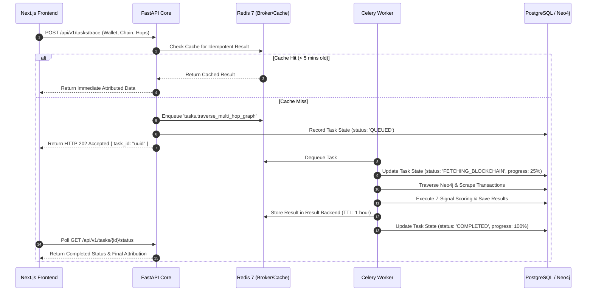

# CHAINTRACE — CACHING STRATEGY & BACKGROUND PROCESSING SPECIFICATION

**Document ID**: CT-CACHE-ASYNC-2026-01  
**Version**: 1.0.0  
**Date**: September 14, 2026  
**Status**: Phase 4 Deliverable — Approved for Implementation Review  
**Stack**: Redis 7 Alpine + Celery 5.4+  

---

## 1. Asynchronous Architecture & Processing Pipeline

Forensic investigations require deep blockchain indexing, multi-hop path calculations, and cryptographic PDF generation. Performing these tasks synchronously inside HTTP request handlers causes 504 Gateway Timeouts and freezes browser tabs.

CHAINTRACE delegates all computationally intensive or I/O-bound workflows to Celery background workers via a dedicated Redis broker:

---

## 2. Redis Database Segmentation Plan

To prevent key collisions and isolate message queues from volatile caches, the Redis instance is partitioned across logical databases:

| Redis DB Index | Dedicated Purpose | Eviction Policy | Persistence | Max Memory Allocation |
|---|---|---|---|---|
| **DB 0** (`/0`) | **Celery Message Broker**: Task queues, routing, and acknowledgments. | `noeviction` (never drop queued tasks) | RDB + AOF enabled | 512 MB |
| **DB 1** (`/1`) | **Celery Result Backend**: Temporary task status and JSON outputs. | `allkeys-lru` | RDB periodic | 512 MB |
| **DB 2** (`/2`) | **Application Cache & Rate Limiting**: RPC responses, balances, tokens. | `volatile-lru` | Ephemeral (no AOF) | 1024 MB |

---

## 3. Cache Key Taxonomy & Invalidation Rules

All application cache keys in Redis DB 2 follow a standardized namespace convention:

| Cache Key Pattern | Cached Data Payload | Time-To-Live (TTL) | Invalidation Trigger |
|---|---|---|---|
| `cache:wallet:summary:{chain}:{address}` | Native balance, fiat INR valuation, token list. | **300 seconds (5 min)** | Expired by TTL or explicit user refresh action. |
| `cache:wallet:txs:{chain}:{address}:{limit}` | Normalized transaction array from external RPC. | **600 seconds (10 min)** | Expired by TTL. |
| `cache:vasp:registry:all` | Complete array of registered VASP entities. | **3600 seconds (1 hr)** | Invalidated upon admin VASP record import/update. |
| `cache:vasp:lookup:{chain}:{address}` | Direct address-to-VASP lookup match. | **86400 seconds (24 hr)** | Invalidated upon new VASP address registration. |
| `cache:graph:path:{chain}:{source}:{max_hops}`| Computed multi-hop shortest paths to nearest VASP. | **900 seconds (15 min)** | Expired by TTL. |
| `ratelimit:ip:{ip_address}:{window}` | Token bucket counter for API rate limiting. | **60 seconds (1 min)** | Sliding window automatic expiry. |

---

## 4. Celery Task Design & Specifications

### Task 1: `tasks.scrape_and_index_wallet`
- **Purpose**: Query external RPC/explorer APIs for wallet transactions and insert into Neo4j graph.
- **Queue**: `blockchain_indexing`
- **Inputs**: `address: str`, `chain: str`, `limit: int = 20`.
- **Outputs**: `indexed_tx_count: int`, `new_nodes_added: int`.
- **Retry Policy**: Maximum 3 retries with exponential backoff (2s, 4s, 8s) on network timeouts.
- **Time Limit**: Soft limit 20s; hard limit 30s.

### Task 2: `tasks.traverse_multi_hop_graph`
- **Purpose**: Execute bounded BFS and Cypher shortest-path discovery up to 5 hops.
- **Queue**: `graph_processing`
- **Inputs**: `starting_address: str`, `chain: str`, `max_hops: int`, `max_nodes: int`.
- **Outputs**: Cytoscape-formatted JSON elements object with nodes, edges, and statistics.
- **Time Limit**: Soft limit 15s; hard limit 25s.

### Task 3: `tasks.compute_explainable_attribution`
- **Purpose**: Calculate the 7-signal mathematical decomposition and determine candidate confidence bands.
- **Queue**: `forensic_scoring`
- **Inputs**: `wallet_address: str`, `chain: str`, `path_data: dict`.
- **Outputs**: `AttributionResponse` payload matching API specification.
- **Idempotency**: Cached for 15 minutes; duplicate calls return identical results without recalculation.

### Task 4: `tasks.generate_forensic_report_pdf`
- **Purpose**: Render court-admissible Section 65B Certificate or Forensic Dossier using ReportLab.
- **Queue**: `report_generation`
- **Inputs**: `investigation_id: str`, `template_type: str`, `officer_metadata: dict`.
- **Outputs**: `report_id: str`, `sha256_checksum: str`, `file_path: str`.
- **Time Limit**: Soft limit 10s; hard limit 15s.

---

## 5. Rate Limiting Strategy (Token Bucket via Redis)

To protect external blockchain RPC quotas and prevent denial-of-service:

| Tier / Route Pattern | Rate Limit Policy | Key Identifier | Action on Limit Exceeded |
|---|---|---|---|
| **Public Endpoints** (`/api/v1/auth/login`) | **10 requests / minute** | Client IP (`ratelimit:login:{ip}`) | HTTP 429 Too Many Requests (Retry-After: 60) |
| **Standard Forensics** (`/api/v1/wallets/*`) | **100 requests / minute** | Officer Badge ID + IP | HTTP 429 with warning notice |
| **Heavy Graph Computations** (`/api/v1/graph/*`)| **20 requests / minute** | Officer Badge ID | HTTP 429 with task queue notice |
| **Report Generation** (`/api/v1/reports/*`) | **15 requests / minute** | Officer Badge ID | HTTP 429 with generation queue notice |

---

*Caching and Asynchronous Processing Specification approved for Phase 4 design gate review.*
