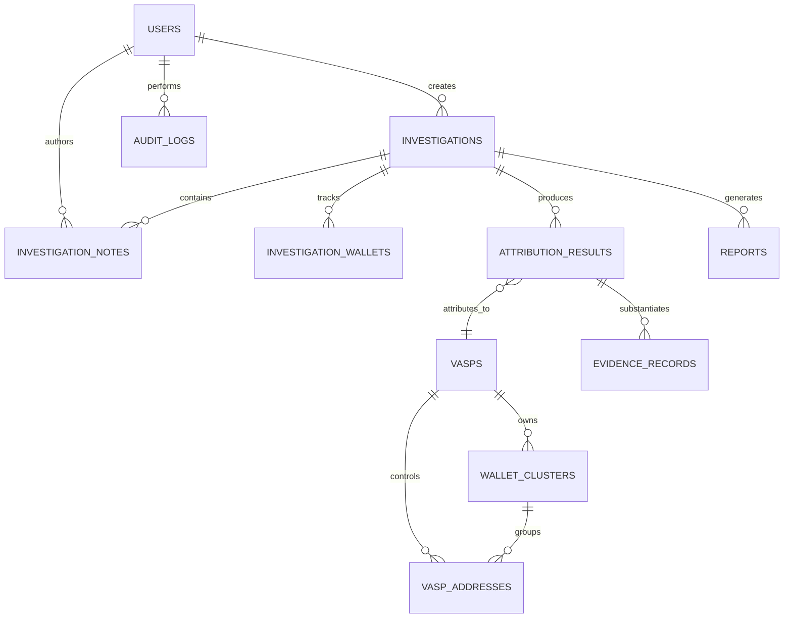

# CHAINTRACE — RELATIONAL DATABASE SCHEMA SPECIFICATION

**Document ID**: CT-DB-SCHEMA-2026-01  
**Version**: 1.0.0  
**Date**: September 14, 2026  
**Status**: Phase 4 Deliverable — Approved for Implementation Review  
**Engine**: PostgreSQL 16 (asyncpg + SQLAlchemy 2.x) with Alembic Migrations  

---

## 1. Entity-Relationship Architecture

The relational schema provides permanent ACID storage for non-graph operational intelligence: investigators, statutory case registers, verified VASP entities, attribution results, evidence items, and cryptographic audit records.



---

## 2. Table Specifications & DDL

### 2.1 Table: `users`
Stores authorized forensic investigators, analysts, and administrators.

```sql
CREATE TABLE IF NOT EXISTS users (
    id UUID PRIMARY KEY DEFAULT gen_random_uuid(),
    badge_id VARCHAR(64) UNIQUE NOT NULL,
    email VARCHAR(255) UNIQUE NOT NULL,
    hashed_password VARCHAR(255) NOT NULL,
    full_name VARCHAR(128) NOT NULL,
    designation VARCHAR(128) NOT NULL,
    agency VARCHAR(255) NOT NULL,
    role VARCHAR(32) NOT NULL CHECK (role IN ('INVESTIGATOR', 'ANALYST', 'ADMINISTRATOR')),
    is_active BOOLEAN NOT NULL DEFAULT TRUE,
    last_login_at TIMESTAMPTZ,
    created_at TIMESTAMPTZ NOT NULL DEFAULT NOW(),
    updated_at TIMESTAMPTZ NOT NULL DEFAULT NOW()
);

CREATE INDEX idx_users_badge_id ON users(badge_id);
CREATE INDEX idx_users_email ON users(email);
```

---

### 2.2 Table: `investigations`
Primary case docket register preserving case data across sessions.

```sql
CREATE TABLE IF NOT EXISTS investigations (
    id UUID PRIMARY KEY DEFAULT gen_random_uuid(),
    case_number VARCHAR(64) UNIQUE NOT NULL, -- e.g. CASE-2026-DEL-042
    title VARCHAR(255) NOT NULL,
    summary TEXT,
    created_by_user_id UUID NOT NULL REFERENCES users(id) ON DELETE RESTRICT,
    agency VARCHAR(255) NOT NULL,
    status VARCHAR(32) NOT NULL DEFAULT 'ACTIVE_TRACE' 
        CHECK (status IN ('ACTIVE_TRACE', 'SUBPOENA_SERVED', 'EVIDENTIARY_FREEZE', 'ESCALATED', 'CLOSED')),
    priority VARCHAR(16) NOT NULL DEFAULT 'HIGH' 
        CHECK (priority IN ('CRITICAL', 'HIGH', 'MEDIUM', 'LOW')),
    total_exposure_inr NUMERIC(18, 2) NOT NULL DEFAULT 0.00,
    created_at TIMESTAMPTZ NOT NULL DEFAULT NOW(),
    updated_at TIMESTAMPTZ NOT NULL DEFAULT NOW()
);

CREATE INDEX idx_investigations_case_number ON investigations(case_number);
CREATE INDEX idx_investigations_status ON investigations(status);
CREATE INDEX idx_investigations_created_by ON investigations(created_by_user_id);
```

---

### 2.3 Table: `investigation_wallets`
Associates cryptocurrency wallets under active investigation with specific case files.

```sql
CREATE TABLE IF NOT EXISTS investigation_wallets (
    id UUID PRIMARY KEY DEFAULT gen_random_uuid(),
    investigation_id UUID NOT NULL REFERENCES investigations(id) ON DELETE CASCADE,
    address VARCHAR(128) NOT NULL,
    chain VARCHAR(32) NOT NULL, -- ethereum, polygon, tron, bitcoin
    label VARCHAR(128),
    is_seed_target BOOLEAN NOT NULL DEFAULT FALSE,
    risk_score NUMERIC(5, 2) DEFAULT 0.00,
    first_seen_at TIMESTAMPTZ,
    last_active_at TIMESTAMPTZ,
    added_at TIMESTAMPTZ NOT NULL DEFAULT NOW(),
    UNIQUE(investigation_id, chain, address)
);

CREATE INDEX idx_inv_wallets_address ON investigation_wallets(chain, address);
```

---

### 2.4 Table: `investigation_notes`
Chronological case notes, investigator observations, and formal legal action memos.

```sql
CREATE TABLE IF NOT EXISTS investigation_notes (
    id UUID PRIMARY KEY DEFAULT gen_random_uuid(),
    investigation_id UUID NOT NULL REFERENCES investigations(id) ON DELETE CASCADE,
    author_user_id UUID NOT NULL REFERENCES users(id) ON DELETE RESTRICT,
    title VARCHAR(255) NOT NULL,
    content TEXT NOT NULL,
    note_type VARCHAR(32) NOT NULL DEFAULT 'OBSERVATION' 
        CHECK (note_type IN ('OBSERVATION', 'EVIDENCE_TAG', 'CRPC_NOTICE', 'FREEZE_ORDER', 'SYSTEM_EVENT')),
    created_at TIMESTAMPTZ NOT NULL DEFAULT NOW()
);

CREATE INDEX idx_inv_notes_case ON investigation_notes(investigation_id);
```

---

### 2.5 Table: `vasps`
Verified Virtual Asset Service Providers (exchanges, custodians) registered with statutory bodies (e.g. FIU-IND).

```sql
CREATE TABLE IF NOT EXISTS vasps (
    id VARCHAR(64) PRIMARY KEY, -- e.g. vasp_coindcx, vasp_binance
    name VARCHAR(255) NOT NULL,
    legal_name VARCHAR(255) NOT NULL,
    country VARCHAR(64) NOT NULL,
    jurisdiction VARCHAR(32) NOT NULL,
    fiu_status VARCHAR(32) NOT NULL CHECK (fiu_status IN ('REGISTERED', 'NOTICE_SERVED', 'NON_COMPLIANT', 'PENDING')),
    fiu_registration_number VARCHAR(64),
    website VARCHAR(255),
    status VARCHAR(32) NOT NULL DEFAULT 'ACTIVE' CHECK (status IN ('ACTIVE', 'SUSPENDED', 'REVOKED', 'UNDER_INVESTIGATION')),
    risk_level VARCHAR(16) NOT NULL DEFAULT 'LOW' CHECK (risk_level IN ('LOW', 'MEDIUM', 'HIGH', 'CRITICAL')),
    nodal_officer_email VARCHAR(255),
    nodal_officer_phone VARCHAR(64),
    created_at TIMESTAMPTZ NOT NULL DEFAULT NOW(),
    updated_at TIMESTAMPTZ NOT NULL DEFAULT NOW()
);

CREATE INDEX idx_vasps_fiu_status ON vasps(fiu_status);
CREATE INDEX idx_vasps_name ON vasps(name);
```

---

### 2.6 Table: `wallet_clusters` & `vasp_addresses`
Relational mapping connecting known exchange deposit sweeps and hot wallets to VASP parent entities.

```sql
CREATE TABLE IF NOT EXISTS wallet_clusters (
    id VARCHAR(64) PRIMARY KEY,
    vasp_id VARCHAR(64) NOT NULL REFERENCES vasps(id) ON DELETE CASCADE,
    name VARCHAR(255) NOT NULL,
    chain VARCHAR(32) NOT NULL,
    cluster_type VARCHAR(32) NOT NULL DEFAULT 'DEPOSIT_SWEEP',
    confidence NUMERIC(4, 3) NOT NULL CHECK (confidence >= 0.0 AND confidence <= 1.0),
    source VARCHAR(255) NOT NULL,
    verification_status VARCHAR(32) NOT NULL DEFAULT 'VERIFIED',
    created_at TIMESTAMPTZ NOT NULL DEFAULT NOW(),
    updated_at TIMESTAMPTZ NOT NULL DEFAULT NOW()
);

CREATE TABLE IF NOT EXISTS vasp_addresses (
    id VARCHAR(64) PRIMARY KEY,
    vasp_id VARCHAR(64) NOT NULL REFERENCES vasps(id) ON DELETE CASCADE,
    cluster_id VARCHAR(64) REFERENCES wallet_clusters(id) ON DELETE SET NULL,
    address VARCHAR(128) NOT NULL,
    chain VARCHAR(32) NOT NULL,
    address_type VARCHAR(32) NOT NULL CHECK (address_type IN ('deposit', 'hot_wallet', 'cold_wallet', 'withdrawal', 'treasury', 'operational', 'unknown')),
    confidence NUMERIC(4, 3) NOT NULL CHECK (confidence >= 0.0 AND confidence <= 1.0),
    source VARCHAR(255) NOT NULL,
    verification_status VARCHAR(32) NOT NULL DEFAULT 'VERIFIED',
    verified_at TIMESTAMPTZ,
    notes TEXT,
    created_at TIMESTAMPTZ NOT NULL DEFAULT NOW(),
    updated_at TIMESTAMPTZ NOT NULL DEFAULT NOW(),
    UNIQUE(chain, address)
);

CREATE INDEX idx_vasp_addr_lookup ON vasp_addresses(chain, address);
CREATE INDEX idx_vasp_addr_vasp ON vasp_addresses(vasp_id);
```

---

### 2.7 Table: `attribution_results` & `evidence_records`
Permanent store for 7-signal mathematical evaluations and evidentiary fact vs inference records.

```sql
CREATE TABLE IF NOT EXISTS attribution_results (
    id UUID PRIMARY KEY DEFAULT gen_random_uuid(),
    investigation_id UUID REFERENCES investigations(id) ON DELETE SET NULL,
    wallet_address VARCHAR(128) NOT NULL,
    chain VARCHAR(32) NOT NULL,
    status VARCHAR(32) NOT NULL CHECK (status IN ('ATTRIBUTED_CANDIDATE', 'NO_RELIABLE_ATTRIBUTION', 'INSUFFICIENT_EVIDENCE')),
    primary_vasp_id VARCHAR(64) REFERENCES vasps(id) ON DELETE SET NULL,
    composite_confidence NUMERIC(5, 2) NOT NULL,
    confidence_band VARCHAR(32) NOT NULL,
    nearest_hops INT NOT NULL DEFAULT 1,
    relationship_type VARCHAR(32) NOT NULL,
    signal_decomposition_json JSONB NOT NULL,
    anti_overclaiming_statement TEXT NOT NULL,
    evaluated_by_user_id UUID NOT NULL REFERENCES users(id) ON DELETE RESTRICT,
    is_production_grade BOOLEAN NOT NULL DEFAULT TRUE,
    created_at TIMESTAMPTZ NOT NULL DEFAULT NOW()
);

CREATE INDEX idx_attribution_wallet ON attribution_results(chain, wallet_address);

CREATE TABLE IF NOT EXISTS evidence_records (
    id UUID PRIMARY KEY DEFAULT gen_random_uuid(),
    attribution_id UUID NOT NULL REFERENCES attribution_results(id) ON DELETE CASCADE,
    signal_name VARCHAR(64) NOT NULL,
    title VARCHAR(255) NOT NULL,
    score NUMERIC(5, 2) NOT NULL,
    weight NUMERIC(4, 3) NOT NULL,
    observed_facts JSONB NOT NULL, -- e.g. ["Target sent 12.45 ETH in tx 0x9f18... to deposit address"]
    inferences JSONB NOT NULL,     -- e.g. ["Consolidated into CoinDCX sweep cluster within 1 hop"]
    statutory_basis VARCHAR(255) NOT NULL, -- e.g. "PMLA Section 12 Forensic Record"
    created_at TIMESTAMPTZ NOT NULL DEFAULT NOW()
);

CREATE INDEX idx_evidence_attribution ON evidence_records(attribution_id);
```

---

### 2.8 Table: `audit_logs`
Cryptographically chained, append-only forensic audit ledger for legal non-repudiation.

```sql
CREATE TABLE IF NOT EXISTS audit_logs (
    id BIGSERIAL PRIMARY KEY,
    event_uuid UUID UNIQUE NOT NULL DEFAULT gen_random_uuid(),
    timestamp TIMESTAMPTZ NOT NULL DEFAULT NOW(),
    officer_badge_id VARCHAR(64) NOT NULL,
    officer_user_id UUID REFERENCES users(id) ON DELETE SET NULL,
    action VARCHAR(64) NOT NULL, -- e.g. VASP_ATTRIBUTION_QUERY, REPORT_DOWNLOAD, CASE_UPDATE
    target_resource VARCHAR(255) NOT NULL, -- wallet address, case ID, etc.
    agency_branch VARCHAR(255) NOT NULL,
    ip_address VARCHAR(45) NOT NULL,
    details_json JSONB,
    prev_hash VARCHAR(64) NOT NULL,
    integrity_hash VARCHAR(64) NOT NULL,
    legal_authority VARCHAR(255) DEFAULT 'CrPC Sec 91 / PMLA Sec 50'
);

CREATE INDEX idx_audit_officer ON audit_logs(officer_badge_id);
CREATE INDEX idx_audit_timestamp ON audit_logs(timestamp);
CREATE INDEX idx_audit_integrity_hash ON audit_logs(integrity_hash);
```

---

### 2.9 Table: `task_records`
Persistent status and performance metrics for Celery background tasks.

```sql
CREATE TABLE IF NOT EXISTS task_records (
    task_id VARCHAR(64) PRIMARY KEY, -- Celery task UUID
    task_name VARCHAR(128) NOT NULL,
    user_id UUID REFERENCES users(id) ON DELETE SET NULL,
    status VARCHAR(32) NOT NULL DEFAULT 'PENDING' 
        CHECK (status IN ('PENDING', 'VALIDATING', 'FETCHING_BLOCKCHAIN', 'BUILDING_GRAPH', 'SCORING_VASPS', 'COMPLETED', 'FAILED')),
    progress_percent INT NOT NULL DEFAULT 0,
    parameters JSONB,
    result_json JSONB,
    error_message TEXT,
    started_at TIMESTAMPTZ,
    completed_at TIMESTAMPTZ,
    created_at TIMESTAMPTZ NOT NULL DEFAULT NOW()
);

CREATE INDEX idx_tasks_user ON task_records(user_id);
CREATE INDEX idx_tasks_status ON task_records(status);
```

---

## 3. SQLAlchemy 2.x Async ORM Mapping

All models are constructed using SQLAlchemy 2.x `DeclarativeBase` with strict Python type annotations:
- File location: `backend/app/models/`
  - `user.py`: `User` model
  - `investigation.py`: `Investigation`, `InvestigationWallet`, `InvestigationNote`
  - `vasp.py`: `Vasp`, `WalletCluster`, `VaspAddress`
  - `attribution.py`: `AttributionResult`, `EvidenceRecord`
  - `audit.py`: `AuditLog`
  - `task.py`: `TaskRecord`

---

*Database Schema Specification approved for Phase 4 design gate review.*
