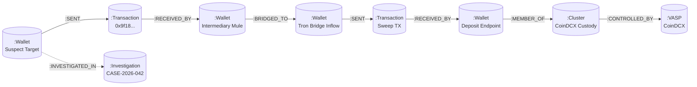

# CHAINTRACE — NEO4J GRAPH SCHEMA & CYPHER SPECIFICATION

**Document ID**: CT-GRAPH-SCHEMA-2026-01  
**Version**: 1.0.0  
**Date**: September 14, 2026  
**Status**: Phase 4 Deliverable — Approved for Implementation Review  
**Engine**: Neo4j 5.27 (Enterprise / Community) with Cypher Query Language  

---

## 1. Graph Topology Overview

The graph database represents topological fund flow networks, multi-hop layering paths, cross-chain relays, and custodial exchange infrastructure.



---

## 2. Node Schema Definitions

### 2.1 Label: `:Wallet`
Represents an individual on-chain cryptocurrency address.
- **Properties**:
  - `address` (STRING, Unique Index): Normalized address (lowercase for EVM; exact case for Tron Base58).
  - `chain` (STRING): `ethereum`, `polygon`, `tron`, `bitcoin`.
  - `label` (STRING, Optional): Human-readable alias (e.g. "Suspect Seed Target", "Mule Account #4").
  - `entity_type` (STRING): `suspect`, `intermediary`, `mixer_proxy`, `bridge_endpoint`, `deposit_address`, `hot_wallet`, `cold_storage`.
  - `risk_score` (FLOAT): Forensic risk indicator ($0.0 \le s \le 100.0$).
  - `threat_level` (STRING): `CRITICAL`, `HIGH`, `MEDIUM`, `LOW`, `VERIFIED`.
  - `balance_native` (FLOAT): Latest cached native coin balance.
  - `first_seen_at` (DATETIME): Timestamp of first recorded transaction.
  - `last_active_at` (DATETIME): Timestamp of most recent transaction.

### 2.2 Label: `:Transaction`
Represents an atomic on-chain fund transfer event.
- **Properties**:
  - `tx_hash` (STRING, Unique Index): Unique transaction identifier.
  - `chain` (STRING): Originating blockchain network.
  - `timestamp` (DATETIME): Block confirmation timestamp.
  - `block_number` (INTEGER): Block height.
  - `amount` (FLOAT): Numerical transfer value.
  - `asset` (STRING): Ticker symbol (`ETH`, `USDT`, `USDC`, `TRX`).
  - `fee` (FLOAT): Transaction network fee paid.

### 2.3 Label: `:VASP`
Represents a Virtual Asset Service Provider legal entity.
- **Properties**:
  - `id` (STRING, Unique Index): Unique entity ID (e.g. `vasp_coindcx`, `vasp_wazirx`).
  - `name` (STRING): Brand name.
  - `legal_name` (STRING): Registered corporate entity name.
  - `country` (STRING): Country of incorporation.
  - `jurisdiction` (STRING): Primary legal jurisdiction.
  - `fiu_status` (STRING): `REGISTERED`, `NOTICE_SERVED`, `NON_COMPLIANT`.
  - `fiu_registration_number` (STRING): Official statutory registration ID.

### 2.4 Label: `:Cluster`
Represents a collection of addresses controlled by the same custodial architecture.
- **Properties**:
  - `id` (STRING, Unique Index): Cluster identifier (e.g. `cluster_binance_hot_evm`).
  - `name` (STRING): Descriptive cluster title.
  - `cluster_type` (STRING): `DEPOSIT_SWEEP`, `HOT_WALLET_POOL`, `COLD_STORAGE`.
  - `confidence` (FLOAT): Clustering confidence score ($0.0 \le c \le 1.0$).

### 2.5 Label: `:Investigation`
Represents an active case docket.
- **Properties**:
  - `case_number` (STRING, Unique Index): Statutory case code (e.g. `CASE-2026-001`).
  - `title` (STRING): Case title.
  - `agency` (STRING): Investigating branch.

---

## 3. Relationship Schema Definitions

| Relationship | Source Node | Target Node | Key Properties | Evidentiary Meaning |
|---|---|---|---|---|
| `:SENT` | `:Wallet` | `:Transaction` | `amount`, `asset`, `timestamp` | Source wallet dispatched funds in transaction. |
| `:RECEIVED_BY`| `:Transaction` | `:Wallet` | `amount`, `asset`, `timestamp` | Target wallet received funds from transaction. |
| `:BRIDGED_TO` | `:Wallet` | `:Wallet` | `bridge_protocol`, `source_chain`, `target_chain`, `tx_hash` | Funds hopped across chains via cross-chain bridge protocol. |
| `:MEMBER_OF` | `:Wallet` | `:Cluster` | `confidence`, `source`, `verified_at` | Address belongs to VASP deposit or hot wallet cluster. |
| `:CONTROLLED_BY`| `:Cluster` | `:VASP` | `legal_basis`, `fiu_verified` | Cluster is owned and operated by statutory VASP. |
| `:INVESTIGATED_IN`| `:Wallet` | `:Investigation` | `added_at`, `officer_badge` | Wallet is formally tagged as an evidentiary item in case. |

---

## 4. Neo4j Constraints & Indexes (DDL)

```cypher
// Uniqueness constraints
CREATE CONSTRAINT c_wallet_unique IF NOT EXISTS
FOR (w:Wallet) REQUIRE (w.chain, w.address) IS UNIQUE;

CREATE CONSTRAINT c_tx_unique IF NOT EXISTS
FOR (t:Transaction) REQUIRE (t.chain, t.tx_hash) IS UNIQUE;

CREATE CONSTRAINT c_vasp_unique IF NOT EXISTS
FOR (v:VASP) REQUIRE v.id IS UNIQUE;

CREATE CONSTRAINT c_cluster_unique IF NOT EXISTS
FOR (c:Cluster) REQUIRE c.id IS UNIQUE;

CREATE CONSTRAINT c_inv_unique IF NOT EXISTS
FOR (i:Investigation) REQUIRE i.case_number IS UNIQUE;

// Performance query indexes
CREATE INDEX idx_wallet_address IF NOT EXISTS FOR (w:Wallet) ON (w.address);
CREATE INDEX idx_wallet_risk IF NOT EXISTS FOR (w:Wallet) ON (w.risk_score);
CREATE INDEX idx_tx_timestamp IF NOT EXISTS FOR (t:Transaction) ON (t.timestamp);
CREATE INDEX idx_vasp_fiu IF NOT EXISTS FOR (v:VASP) ON (v.fiu_status);
```

---

## 5. Authoritative Parameterized Cypher Queries

### Query 1: Bounded Multi-Hop BFS Traversal
Retrieves all connected transaction paths outward from suspect wallet within $K$ hops (bounded by `max_nodes`).

```cypher
MATCH (start:Wallet {address: $target_address, chain: $chain})
MATCH path = (start)-[:SENT|RECEIVED_BY*1..6]->(end_node)
WHERE length(path) <= $max_hops * 2
WITH nodes(path) AS path_nodes, relationships(path) AS path_rels
UNWIND path_nodes AS n
WITH DISTINCT n, path_rels
LIMIT $max_nodes
RETURN n.address AS address, n.chain AS chain, n.entity_type AS entity_type, 
       n.label AS label, n.risk_score AS risk_score;
```

### Query 2: Shortest Path to Nearest Attributed VASP
Calculates the absolute shortest evidentiary path connecting the suspect address to an exchange custody cluster.

```cypher
MATCH (start:Wallet {address: $target_address, chain: $chain})
MATCH (vasp:VASP)
MATCH p = shortestPath((start)-[:SENT|RECEIVED_BY|BRIDGED_TO*1..10]-(target_addr:Wallet)-[:MEMBER_OF]->(c:Cluster)-[:CONTROLLED_BY]->(vasp))
WITH vasp, p, length(p) AS raw_edges, target_addr
ORDER BY raw_edges ASC
LIMIT 3
RETURN vasp.id AS vasp_id,
       vasp.name AS vasp_name,
       vasp.legal_name AS legal_name,
       vasp.fiu_status AS fiu_status,
       vasp.fiu_registration_number AS fiu_reg_no,
       target_addr.address AS deposit_address,
       // Raw edge count divided by 2 gives actual wallet hop count
       (raw_edges / 2) AS nearest_hops,
       [node IN nodes(p) WHERE 'Wallet' IN labels(node) | node.address] AS wallet_trail,
       [rel IN relationships(p) WHERE type(rel) = 'SENT' | rel.amount] AS amounts;
```

### Query 3: Anti-Overclaiming Verification
Verifies whether an address has ANY verifiable path to known VASPs before calculating scores:

```cypher
MATCH (start:Wallet {address: $target_address, chain: $chain})
OPTIONAL MATCH (start)-[:SENT|RECEIVED_BY*1..6]-(target:Wallet)-[:MEMBER_OF]->(:Cluster)-[:CONTROLLED_BY]->(v:VASP)
RETURN count(v) > 0 AS has_verifiable_vasp_link,
       collect(DISTINCT v.id) AS candidate_vasp_ids;
```

---

*Graph Schema Specification approved for Phase 4 design gate review.*
