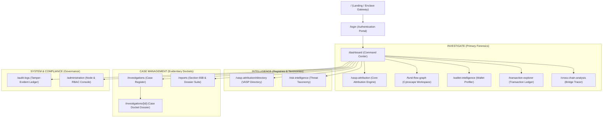

# CHAINTRACE — INFORMATION ARCHITECTURE & NAVIGATION SPECIFICATION

**Document ID**: CT-UX-IA-2026-01  
**Version**: 1.0.0  
**Date**: September 14, 2026  
**Status**: Phase 5 Deliverable — Approved for Implementation Review  

---

## 1. Global Sitemap & Navigation Hierarchy

The information architecture organizes forensic tasks into 5 operational domains reflecting law enforcement and intelligence workflows:

---

## 2. Navigation Structure & Menus

### 2.1 Tactical Navigation Sidebar (Desktop: `w-64` Fixed)
- **Top Brand Section**: Geometric octagon logo, platform status pill (`PRODUCTION // CONNECTED` or `DEMO // FALLBACK`).
- **Section 1: COMMAND**
  - Command Dashboard (`/dashboard`) — Primary operational overview.
- **Section 2: INVESTIGATE**
  - VASP Attribution (`/vasp-attribution`) — Primary engine; highlighted with gold badge (`CORE ENGINE`).
  - Fund Flow Graph (`/fund-flow-graph`) — Cytoscape.js interactive multi-hop canvas.
  - Wallet Intelligence (`/wallet-intelligence`) — Financial profiling and token breakdown.
  - Transaction Explorer (`/transaction-explorer`) — Filterable transaction hop table.
  - Cross-Chain Analysis (`/cross-chain-analysis`) — Bridge hop tracer.
- **Section 3: INTELLIGENCE**
  - Risk Intelligence (`/risk-intelligence`) — Threat indicators and mixer exposure.
  - VASP Directory (`/vasp-attribution#directory`) — FIU-IND registered entities.
- **Section 4: CASE MANAGEMENT**
  - Investigations Register (`/investigations`) — Case dockets (badge showing active count).
  - Evidentiary Reports (`/reports`) — Certified PDF downloads.
- **Section 5: SYSTEM (Tier 4 / Admin Only)**
  - Chain-of-Custody Logs (`/audit-logs`) — SHA-256 audit ledger.
  - Node Administration (`/administration`) — RPC status and cluster settings.
- **Bottom Officer Profile Section**: Officer avatar, name, badge ID, clearance tier, and secure logout action.

---

### 2.2 Mobile Navigation Drawer (Viewport `< 1024px`)
- **Header**: Compact classification bar with hamburger menu button (`☰`) and quick theme toggle.
- **Slide-Out Sheet**: Left-aligned 280px drawer containing identical navigation links with touch-optimized 44px hit targets.
- **Main Container**: Replaces desktop `pl-64` margin with full-width responsive padding (`px-4 pt-16 pb-8`).

---

## 3. Screen Specifications & User Goal Mapping

| Screen Route | Primary User Goal | Primary Call to Action | Critical Supporting Data |
|---|---|---|---|
| `/dashboard` | Triage priority investigations and initiate immediate wallet attribution. | Quick Trace input bar (`Trace Wallet`). | Active case dockets, high-risk wallet detections, Celery background worker queue status. |
| `/vasp-attribution` | Automatically determine nearest VASP with transparent mathematical evidence. | "Execute Attribution Engine" | 7-signal radar chart, candidate ranking table, deposit sweep match details, anti-overclaiming disclaimer. |
| `/fund-flow-graph` | Interactively explore transaction paths and visual multi-hop hops. | "Highlight Attribution Path" | Cytoscape.js nodes (suspect, mule, bridge, VASP), edge tx amounts, node details inspector drawer. |
| `/wallet-intelligence` | Inspect wallet balances, transaction velocity, and risk indicators. | "Add to Investigation Docket" | Native balance, fiat INR value (`₹`), token contracts, mixer/OFAC risk tags. |
| `/transaction-explorer` | Granular examination of individual transaction hashes and token movements. | Filter by Asset / Amount / Date. | From/To addresses, gas fees, block height, raw tx payload modal. |
| `/investigations` | Manage persistent case dockets across legal proceedings. | "Initiate New Investigation" | Case status badges, lead officer, total exposure INR, attached wallet count. |
| `/investigations/[id]` | Comprehensive case timeline and statutory notices. | "Issue CrPC 91 Notice" | Case timeline, evidence records, attached wallets, subpoena dispatch status. |
| `/reports` | Export court-admissible Section 65B Electronic Certificates and Dossiers. | "Download Signed PDF Dossier" | Case metadata, certifying officer badge, SHA-256 integrity seal, QR code. |
| `/audit-logs` | Verify legal chain-of-custody and non-repudiation. | "Verify Ledger Integrity" | Chained SHA-256 hash proofs, officer badge IDs, query action types, timestamps. |
| `/administration` | Monitor node RPC health and provision officer roles. | "Test Node Latency" | PostgreSQL, Neo4j, Redis connectivity, RPC block heights, user RBAC table. |

---

*Information Architecture specification approved for Phase 5 review.*
