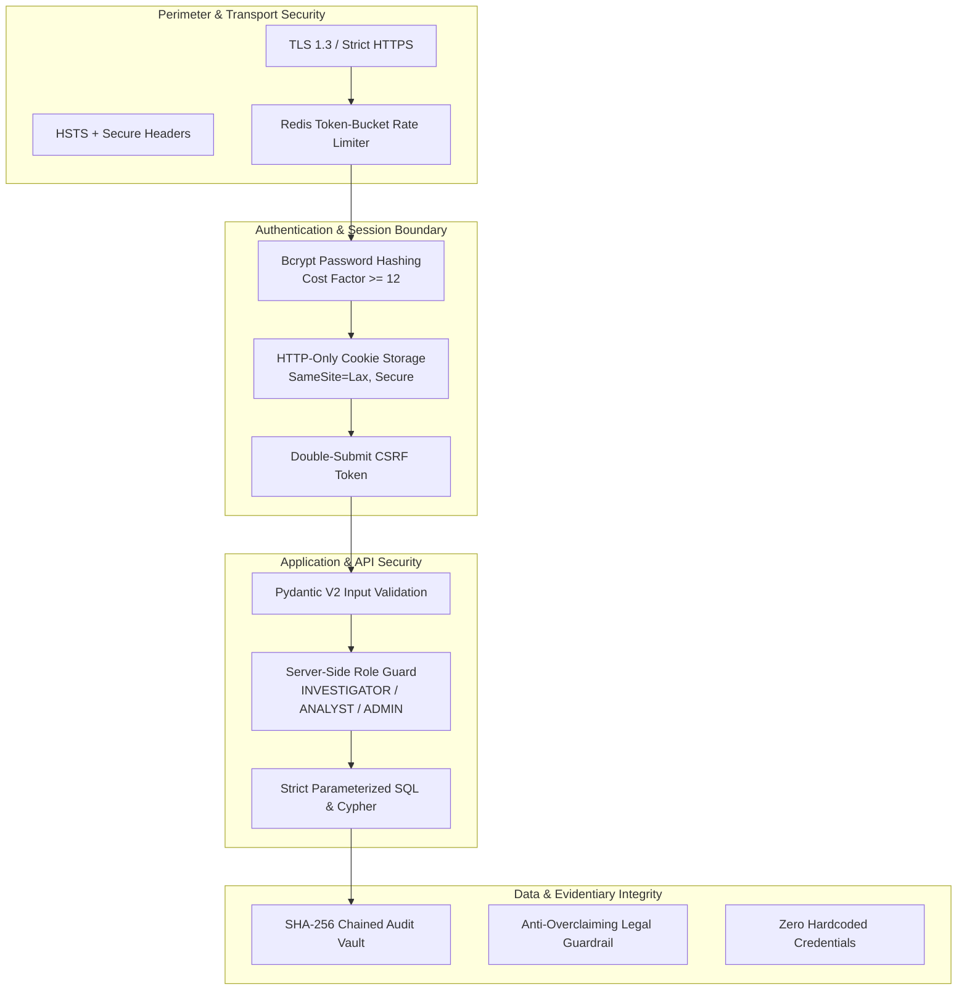

# CHAINTRACE — SECURITY ARCHITECTURE & THREAT MODEL

**Document ID**: CT-SEC-PLAN-2026-01  
**Version**: 1.0.0  
**Date**: September 14, 2026  
**Status**: Phase 4 Deliverable — Approved for Implementation Review  

---

## 1. Security Architecture & Core Controls

As a dedicated cryptocurrency intelligence platform for Law Enforcement Agencies (LEAs) and statutory intelligence analysts, **CHAINTRACE** implements defense-in-depth security across all architectural tiers.



---

## 2. Authentication & Session Management

### 2.1 Credential Protection
- **Hashing Algorithm**: `bcrypt` via Python `passlib` with cost factor 12.
- **Salting**: Automatic cryptographically secure unique 16-byte salt per user.
- **Passphrase Rules**: Minimum 10 characters, requiring uppercase, lowercase, numeric digit, and special symbol.

### 2.2 Token & Cookie Specification
To completely eliminate `localStorage` XSS theft vulnerabilities:
- **Access Token**:
  - Format: Signed JWT (`HS256` or `RS256`).
  - Expiry: 15 minutes.
  - Storage: Injected exclusively via `Set-Cookie`:
    ```http
    Set-Cookie: chaintrace_access_token=<JWT>; Path=/api; HttpOnly; Secure; SameSite=Lax; Max-Age=900
    ```
- **Refresh Token**:
  - Expiry: 7 days.
  - Storage: Injected via separate HTTP-only cookie restricted to `/api/v1/auth/refresh`.
  - Rotation: Automatic single-use rotation with token reuse detection (family invalidation).
- **CSRF Protection**:
  - Double-submit CSRF pattern.
  - Cookie: `chaintrace_csrf_token=<random_token>; Path=/; Secure; SameSite=Lax` (accessible to JavaScript).
  - All modifying requests (`POST`, `PUT`, `PATCH`, `DELETE`) must include header `X-CSRF-Token` matching the cookie value.

---

## 3. Server-Side Role-Based Authorization (RBAC)

Authorization is strictly verified on the server side in FastAPI request dependencies. Client-side state is never trusted.

| Role | Operational Scope & Clearance | Permitted Actions | Restricted Actions |
|---|---|---|---|
| **INVESTIGATOR** | Field officer handling specific complaints / FIRs. | Create cases, run wallet attribution, view own case graphs, export Section 65B reports. | Cannot modify VASP registry, view system audit ledger, or change node settings. |
| **ANALYST** | Senior forensic specialist handling complex syndicates. | All investigator actions + deep 5-hop graph traversals, custom cluster tagging, and bulk VASP imports. | Cannot manage user accounts or alter cluster connection settings. |
| **ADMINISTRATOR** | Infrastructure and security administrator. | User account provisioning, role assignment, system health monitoring, audit ledger verification, node RPC configuration. | Case dockets are strictly read-only unless co-assigned as an investigating officer. |

---

## 4. Query Injection Defenses

### 4.1 SQL Injection Prevention
- **Implementation**: SQLAlchemy 2.x ORM and Core with `asyncpg`.
- **Rule**: Absolutely zero raw string concatenation in SQL queries. All parameters passed through typed SQLAlchemy models or `bindparam`.

### 4.2 Cypher Injection Prevention
- **Implementation**: Neo4j Python Driver 5.27.
- **Rule**: Parameterized Cypher query dictionaries:
  ```python
  # SAFE: Strict parameterized Cypher
  session.run(
      "MATCH (w:Wallet {address: $addr, chain: $chain}) RETURN w",
      {"addr": normalized_address, "chain": chain_id}
  )
  ```
- **Prohibition**: Never execute `session.run(f"MATCH (w:Wallet {{address: '{addr}'}})...")`.

---

## 5. Security Threat Model (STRIDE Analysis)

| STRIDE Threat Category | Potential Attack Vector | Impact on CHAINTRACE | Implemented Architectural Mitigation |
|---|---|---|---|
| **Spoofing** | Attacker steals or forges officer badge ID to run unauthorized queries. | Unauthorized intelligence retrieval; compromised officer identity. | Multi-factor JWT token tied to IP and user-agent; passwords hashed with bcrypt; HTTP-only cookies prevent script access. |
| **Tampering** | Rogue actor or corrupted script alters historical case notes or audit records. | Case evidence dismissed in court under Indian Evidence Act scrutiny. | Immutable, append-only PostgreSQL `audit_logs` table with SHA-256 hash chaining ($H_n = \text{SHA256}(H_{n-1} + \text{data})$). |
| **Repudiation** | Investigating officer denies performing an unauthorized wallet search. | Inability to audit LEA misconduct or data leaks. | Every query automatically commits an immutable audit event recording officer ID, IP, timestamp, and target resource. |
| **Information Disclosure** | Sensitive case dossiers or suspect wallet lists leaked via unauthenticated API. | Compromise of ongoing high-priority money laundering investigation. | All `/api/v1/*` endpoints protected by JWT session dependency; sensitive attributes stripped from public responses. |
| **Denial of Service** | Malicious script submits 50-hop graph requests or floods RPC endpoints. | System freeze; RPC quota exhaustion; platform outage during active raid. | Rate limiting via Redis token bucket (100 req/min per IP); hard limits on graph depth ($K \le 5$) and node limit ($N \le 100$). |
| **Elevation of Privilege** | Investigator manipulates request body to assign themselves `ADMINISTRATOR` role. | Unauthorized takeover of node credentials and audit logs. | Role assignment endpoints strictly protected by `get_current_admin` dependency; role field in user update DTO ignored unless admin. |

---

## 6. Secret Management & Anti-Overclaiming Guardrails

1. **Zero Cleartext Credentials**:
   - All RPC URLs, Explorer API keys, database credentials, and JWT secret keys are loaded strictly via Pydantic `BaseSettings` reading environment variables (`.env`).
   - `.env` is committed to `.gitignore`; `.env.example` provides sanitized placeholders.
2. **Statutory Anti-Overclaiming Protocol**:
   - The platform never fabricates or speculates on VASP ownership.
   - When no path connects an address to a VASP, the system strictly returns `NO_RELIABLE_ATTRIBUTION` with confidence `0.0%`.
   - Every view, report, and export carries the statutory evidentiary caveat:
     > *"Scores represent investigative attribution confidence, not legal determination of ownership."*

---

*Security Architecture specification approved for Phase 4 design gate review.*
